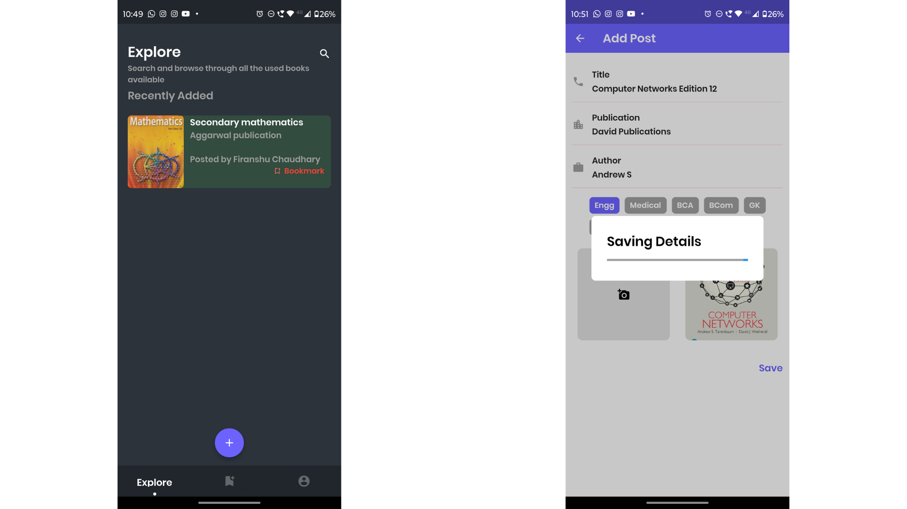
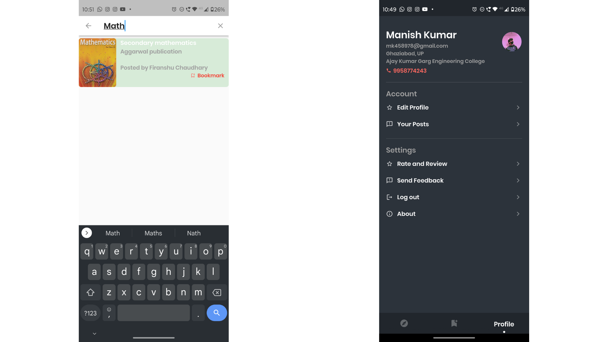

<h1 align="center" id="title">Venlo</h1>

- Venlo is a Mobile application for students to let the public know about their unused books so that the needy ones can communicate and get it.
- It uses Firebase (Backed as a service) to store the data and Flutter as a frontend framework.
- apk link: [venlo.apk](./assets/post-build/venlo.apk)

---

### Project Screenshots




---  
  
### 🧐 Features
- Integrated with Google Authentication
- User can post their books
- User can see the books posted by others
- User can see the profile of the book owner
- User can call the book owner

---

### 🛠️ Installation Steps
```sh
# flutter version : 2.5.3
flutter pub get
flutter run
```

---


### 💻 Technologies Used
- runtime/ framework: Flutter
- dependencies: flutter_bloc, firebase_auth, cloud_firestore, shared_preferences, etc.
- third-party: Firebase